<div align="center">



<br/>

[](https://docs.python.org/3/)
[](https://fastapi.tiangolo.com/)
[](https://docs.docker.com/)
[](https://qdrant.tech/documentation/)
[](https://openai.com/research/clip)
[](https://docs.streamlit.io/)

</div>

---

## ⚡ Live Search Pipeline

> *Every user upload fires this entire pipeline — and results land back in under 20 milliseconds.*

<div align="center">



</div>

The animation traces the full real-time journey: your image enters **FastAPI**, gets encoded into a 512-number fingerprint by **CLIP**, lands in **Qdrant** where it's compared against every stored vector using cosine similarity, and the 10 closest matches fly back to your screen — all before you can blink.

---

## 🧠 What Is This Project?

Imagine **Google Lens** — but entirely self-hosted, and tuned precisely for your own product catalog.

This is a **Visual Product Search Engine** that lets users upload any clothing image and instantly surface the **10 most visually similar products** from a database — **without typing a single keyword**.

The magic lives in a deceptively simple idea:

> *Every image can be converted into a list of 512 numbers — a mathematical fingerprint called a **vector** — that captures its color, shape, style, and texture. Images that look alike have similar numbers. Finding similar products means finding similar numbers.*

Upload a red sneaker → the engine finds every other sneaker that shares its color, silhouette, and sole shape. Upload a tote bag → it returns tote bags. Upload a striped sweater → striped sweaters appear. **No rules written. No tags required. The AI figures it out.**

But the engine doesn't stop at images. You can also **search by typing a text description** — such as *"red running shoes"* or *"striped summer dress"* — and CLIP converts your words into the exact same 512-dimensional vector space as the images. The result: visually matching products surface instantly, with no image upload required. Same pipeline, same sub-20ms speed, zero extra models needed.

---

## 🔬 Core Concepts — Made Simple

Before diving into architecture, here is a concise breakdown of the three technologies powering this engine.

### 🔢 What Is a Vector?

A vector is an ordered list of numbers encoding the **visual meaning** of an image:

```
Photo of a red sneaker  →  [0.21, -0.84, 0.67, 0.44, 0.98, ... 507 more numbers]
Photo of a blue jacket  →  [0.11,  0.92, 0.12, 0.77, 0.03, ... 507 more numbers]
```

Two images that *look* similar will produce *numerically similar* vectors. That single principle is the entire foundation of this system — and it scales to millions of products without any additional engineering.

---

### 🧩 What Is CLIP?

**CLIP** (Contrastive Language–Image Pretraining) is an AI model from [OpenAI](https://openai.com/research/clip) trained on 400 million image–text pairs scraped from the internet. It learned to embed both **images** and **text** into the same 512-dimensional mathematical space:

```
"red running shoes"  ──►  [0.21, -0.84, 0.67 ...]  ◄── 📸 Photo of red running shoes
                                     ↑
                           Nearly identical vectors!
```

This shared space is why this engine supports **both image search and text search** — CLIP converts both into vectors, and the same similarity search finds matches either way. Zero extra code required.

---

### 📐 What Is Cosine Similarity?

Cosine similarity measures the **angle** between two vectors. A smaller angle signals greater visual resemblance:

| Score | Meaning | Angle |
|-------|---------|-------|
| `1.00` | Identical images | 0° |
| `0.95` | Highly similar | ≈ 18° |
| `0.80` | Related style | ≈ 37° |
| `0.50` | Loosely related | ≈ 60° |
| `0.00` | Completely different | 90° |

---

### 🗄️ What Is Qdrant?

[Qdrant](https://qdrant.tech/documentation/) is a **vector database** — think of it as PostgreSQL, but instead of matching exact column values it matches *mathematical closeness*:

```sql
-- Normal database (exact match only):
SELECT * FROM products WHERE category = 'sneaker'

-- Qdrant (similarity match):
FIND vectors NEAREST TO [0.21, -0.84, 0.67 ...] LIMIT 10
```

Internally Qdrant uses **HNSW** (Hierarchical Navigable Small World) graphs — a data structure that locates the nearest vectors in milliseconds across millions of entries, without scanning every single one.

---

## 🗺️ Architecture — The Big Picture

```
┌─────────────────────────────────────────────────────────────────────┐
│                          DOCKER NETWORK                             │
│                                                                     │
│   ┌──────────────┐     ┌──────────────────┐     ┌───────────────┐   │
│   │  qdrant_db   │◄────│  visual_search   │◄────│ streamlit_ui  │   │
│   │              │     │    (FastAPI)      │     │  (Frontend)   │   │
│   │ Vector Store │     │    Port 8000      │     │   Port 8501   │   │
│   │  Port 6333   │     └──────────────────┘     └───────────────┘   │
│   └──────────────┘                                                  │
└─────────────────────────────────────────────────────────────────────┘
        ▲                         ▲                       ▲
   localhost:6333            localhost:8000          localhost:8501
        │                         │                       │
        └─────────────────────────┴───────────────────────┘
                               Your Browser
```

Three Docker containers work in concert, orchestrated by a single `docker-compose.yml`:

| Container | Role | Port |
|-----------|------|------|
| `qdrant_db` | Vector database — stores and searches 512-dim vectors | `6333` |
| `visual_search` | FastAPI backend — receives uploads, calls CLIP, queries Qdrant | `8000` |
| `streamlit_ui` | Streamlit frontend — the user-facing search interface | `8501` |

They communicate with each other by container name over Docker's internal network — no manual networking configuration needed.

---

## 📁 Project Structure

```
Visual_Product_Search_Engine_Project/
│
├── 🐳 docker-compose.yml           ← Orchestrates all 3 containers
├── 🐳 Dockerfile                   ← Builds the FastAPI container
├── 🐳 Dockerfile.streamlit         ← Builds the Streamlit container
├── 📋 requirements.txt             ← Python dependencies
│
├── backend/                        ← FastAPI application
│   ├── app.py                      ← Main API server — /search, /search-by-text
│   ├── clip_encoder.py             ← Loads CLIP, encodes a single image
│   ├── embedder.py                 ← CLIPEmbedder class (reusable module)
│   ├── vector_store.py             ← Qdrant client + collection setup
│   └── config.py                   ← Settings (model name, vector size, etc.)
│
├── frontend/
│   └── front_end.py                ← Space-themed Streamlit search interface
│
├── data/
│   ├── images/                     ← 500 Fashion-MNIST product images
│   └── qdrant_data/                ← Persistent Qdrant vector storage
│       └── collections/
│           └── Products/           ← 500 stored vectors live here
│
└── scripts/
    └── prepare_data.py             ← One-time script: encode images → store in Qdrant
```

Every file has a single, focused responsibility. The backend is split into clean modules so that swapping out CLIP for a different encoder, or Qdrant for another vector DB, requires touching only one file.

---

## 🔄 How It Works — Phase by Phase

### Phase 1 — One-Time Setup (Building the Vector Database)

Run `prepare_data.py` once to encode all 500 product images and persist them into Qdrant. This never needs to run again unless you change your catalog:

```
500 Fashion-MNIST images
         │
         ▼
┌──────────────────────┐
│     CLIP Encoder      │  ← openai/clip-vit-base-patch32
│   clip_encoder.py     │    Downloads from Hugging Face (~340 MB)
└──────────────────────┘
         │  Converts each image → 512 floats
         ▼
┌──────────────────────┐
│    Qdrant Database   │  ← Stores: ID + vector + image path
│    vector_store.py   │
└──────────────────────┘

What gets stored in Qdrant:
┌──────┬──────────────────────────────────────────┬────────────────────┐
│  ID  │ Vector (512 numbers)                     │ Payload (metadata) │
├──────┼──────────────────────────────────────────┼────────────────────┤
│ 0001 │ [0.21, -0.84, 0.67, 0.44, ...]           │ 0001_sneaker.png   │
│ 0002 │ [0.67,  0.03, 0.19, 0.81, ...]           │ 0002_bag.png       │
│ 0003 │ [0.19, -0.81, 0.44, 0.55, ...]           │ 0003_sneaker.png   │
│ ...  │ ...                                       │ ...                │
│ 0500 │ [0.88,  0.12, 0.91, 0.24, ...]           │ 0500_jacket.png    │
└──────┴──────────────────────────────────────────┴────────────────────┘
```

---

### Phase 2 — Live Search (Every User Query)

```
User uploads image (e.g. a bag photo)
         │
         ▼ POST /search
┌──────────────────────┐
│       FastAPI         │  ← app.py receives the multipart upload
│        app.py         │
└──────────────────────┘
         │
         ▼
┌──────────────────────┐
│     CLIP Encoder      │  ← Same model, same 512-number space
│   clip_encoder.py     │    Query image → query vector
└──────────────────────┘
         │  query_vector = [0.44, -0.12, 0.88, ...]
         ▼
┌──────────────────────┐
│   Qdrant ANN Search  │  ← "Find the 10 closest vectors
│   vector_store.py    │     using cosine similarity"
└──────────────────────┘
         │
         ▼
Top 10 results with similarity scores
→ FastAPI returns JSON
→ Streamlit renders product image grid
```

The full round-trip — upload to displayed results — completes in **under 20ms**.

---

## 🚀 Quick Start — Run in 3 Commands

### Prerequisites

- ✅ [Docker Desktop](https://docs.docker.com/get-started/introduction/get-docker-desktop/) installed and running
- ✅ ~10 GB free disk space (CLIP model weights ~600 MB; Docker images ~10 GB total)
- ✅ Any modern browser

### Step 1 — Clone the Repository

```bash
git clone https://github.com/SoupFIX/AI_projects.git
```

### Step 2 — Navigate to the Project Folder

```bash
cd AI_projects/Visual_Product_Search_Engine_project
```

### Step 3 — Launch Everything

```bash
docker-compose up
```

> ⏳ **First run takes 5–6 minutes.** Docker pulls all images and the CLIP model (~600 MB) downloads and loads into memory. All subsequent starts take ~30 seconds.

### ✅ Access the Application

Once all containers are running, open your browser:

| Service | URL | Purpose |
|---------|-----|---------|
| 🎨 **Streamlit UI** | http://localhost:8501 | Main search interface — upload images here |
| ⚡ **FastAPI Backend** | http://localhost:8000 | REST API + auto-generated Swagger docs |
| 🗄️ **Qdrant Dashboard** | http://localhost:6333/dashboard | Explore the vector database visually |


### To Find and Upload Image : 
|Your Project Folder(inside which you cloned the repo)|+|From Here This is always the same. |
|-----------------------------------------------------|-|-----------------------------------|
|Your Main Folder|\AI_projects\Visual_Product_Search_Engine_Project\data\images|


### 🛑 Stopping the Application

```bash
# Recommended: clean stop, releases all ports
docker-compose down

# Or press Ctrl+C (2–3 times) in the terminal running compose
```

> 💡 Always prefer `docker-compose down` over killing the terminal. It cleanly releases ports so you won't hit `port already allocated` errors on the next start.

---

## 🔌 API Reference

### `POST /search` — Search by Image

Upload any image and receive the 10 most visually similar products with scored rankings.

```bash
curl -X POST "http://localhost:8000/search" \
     -F "file=@your_image.png"
```

**Response:**

```json
{
  "query_file": "your_image.png",
  "total_results": 10,
  "results": [
    { "rank": 1, "score": 0.9823, "image_path": "/images/0044_sneaker.png", "id": 44 },
    { "rank": 2, "score": 0.9712, "image_path": "/images/0118_sneaker.png", "id": 118 },
    { "rank": 3, "score": 0.9501, "image_path": "/images/0302_sneaker.png", "id": 302 }
  ]
}
```

---

### `POST /search-by-text` — Search by Text Description

Type a natural-language description and find matching product images. Powered entirely by CLIP's shared image-text vector space — no separate text model needed.

```bash
curl -X POST "http://localhost:8000/search-by-text?query=red%20running%20shoes"
```

---

### `GET /` — Health Check

```bash
curl http://localhost:8000/
# → {"message": "✅ Visual Search Engine is running!"}
```

---

## 🐳 Docker Images

Both images are publicly available on Docker Hub. Pull them directly without building locally:

> 🔗 **[View on Docker Hub → soup28/visual-product-search-engine](https://hub.docker.com/repository/docker/soup28/visual-product-search-engine/general)**

| Image | Tag | Size | Purpose |
|-------|-----|------|---------|
| `soup28/visual-product-search-engine` | `api-1.0.0` | 8.93 GB | FastAPI + CLIP + PyTorch |
| `soup28/visual-product-search-engine` | `ui-1.0.0` | 1.02 GB | Streamlit frontend |

```bash
# Pull images manually if you prefer
docker pull soup28/visual-product-search-engine:api-1.0.0
docker pull soup28/visual-product-search-engine:ui-1.0.0
```

> The API image is large because it bundles PyTorch and all CLIP neural network weights. This is a one-time download — subsequent `docker-compose up` commands start instantly.

---

## 🛠️ Tech Stack

| Technology | Role | Why This Choice |
|------------|------|-----------------|
| [**OpenAI CLIP**](https://openai.com/research/clip) | Image & text → vector encoder | Understands both modalities in a unified 512-dim space; enables text search for free |
| [**Qdrant**](https://qdrant.tech/documentation/) | Vector database | Best-in-class ANN search, excellent Python client, local persistent storage |
| [**FastAPI**](https://fastapi.tiangolo.com/) | REST API server | Async I/O, auto-generated Swagger docs, minimal boilerplate |
| [**Streamlit**](https://docs.streamlit.io/) | Frontend UI | Python-native rapid development, perfect for ML demos |
| [**PyTorch**](https://pytorch.org/docs/) | ML framework | Required by Transformers / CLIP model weights |
| [**Docker Compose**](https://docs.docker.com/compose/) | Container orchestration | Reproducible, portable — 3 services running with 1 command |
| [**Fashion-MNIST**](https://github.com/zalandoresearch/fashion-mnist) | Dataset | 70,000 labeled clothing images, ideal for product search demos |

---

## 📊 Performance Characteristics

```
Dataset size:         500 Fashion-MNIST images
Vector dimensions:    512 (float32)
Index algorithm:      HNSW (Hierarchical Navigable Small World)
Distance metric:      Cosine similarity
Search latency:       < 20ms per query
Model cold-start:     ~30s (CLIP loading on first run)
Storage per vector:   ~2KB (vector only, excluding image files)
Scales to:            Millions of vectors with no code changes
```

---

## 🔭 How to Extend This Project

The architecture is intentionally modular. Here are natural next steps:

- **Swap the dataset** — Replace Fashion-MNIST with your own product catalog. Update `prepare_data.py` to point at your images directory. Zero other changes.
- **Scale to millions** — Qdrant handles millions of vectors natively. Just run `prepare_data.py` on a larger dataset.
- **Add metadata filtering** — Qdrant supports payload filters. Store price, category, or brand in the payload and filter search results server-side before returning them.
- **Swap the encoder** — Replace CLIP with a domain-specific model (e.g. a fine-tuned ViT for furniture). Change one line in `config.py`.
- **Hybrid text + image search** — Average the text query vector and image query vector together, then search. CLIP's shared space makes this trivially correct.

---

## 📜 License

```
PERSONAL USE & LEARNING LICENSE
────────────────────────────────────────────────────────────────────────

Copyright (c) 2024 SoupFIX

Permission is hereby granted, free of charge, to any person obtaining
a copy of this software to:

  ✅  Run and experiment with it on their own local machine
  ✅  Read, study, and learn from the source code in depth
  ✅  Modify it privately for personal educational purposes
  ✅  Reference specific techniques or patterns with clear attribution

The following are explicitly NOT permitted:

  ❌  Copying this project in whole or in substantial part and
      publishing it as your own — on GitHub, npm, PyPI, or elsewhere
  ❌  Submitting this project or a close derivative as your own work
      for academic, professional, or commercial purposes
  ❌  Redistributing under a different name without prominent
      attribution linking back to the original author and repository

Attribution requirement:
  Any permitted derivative or reference must include a visible link
  to the original repository and credit to the original author.

The intent of this license is simple:
  → Learn from this freely. Build on the ideas. Do not plagiarize.

THE SOFTWARE IS PROVIDED "AS IS", WITHOUT WARRANTY OF ANY KIND.
THE AUTHOR IS NOT LIABLE FOR ANY CLAIM OR DAMAGES ARISING FROM USE.
```

---

## 🙏 Acknowledgements

- [OpenAI CLIP](https://openai.com/research/clip) — The vision-language model powering all image and text encoding
- [Qdrant](https://qdrant.tech/) — The vector database making sub-20ms similarity search possible
- [Fashion-MNIST by Zalando Research](https://github.com/zalandoresearch/fashion-mnist) — The open-source clothing image dataset
- [Hugging Face Transformers](https://huggingface.co/openai/clip-vit-base-patch32) — CLIP model hosting and Python interface
- [FastAPI](https://fastapi.tiangolo.com/) — The async Python web framework
- [Streamlit](https://streamlit.io/) — The Python-native UI framework

---

<div align="center">

**Built with 🧠 + ⚡ + 🐳**

*If this project helped you understand vector search or AI-powered retrieval,*
*a ⭐ on the repository is always appreciated.*

</div>
